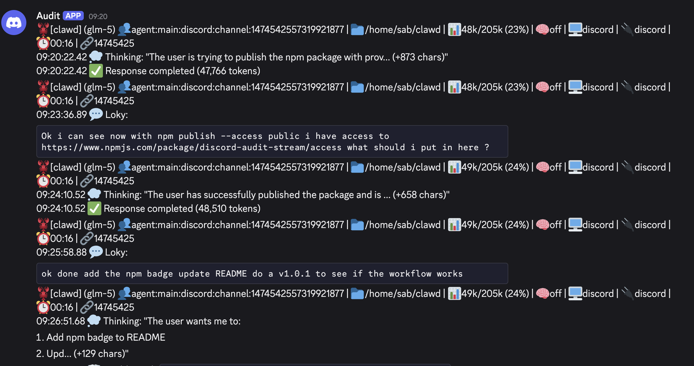

# OpenClaw Discord Audit Stream

[](https://badge.fury.io/js/openclaw-discord-audit-stream)
[](https://opensource.org/licenses/MIT)
[](https://github.com/Sabrimjd/discord-audit-stream/releases)



Monitor all OpenClaw session events and stream them to a Discord channel in real-time.

## Installation

```bash
openclaw plugins install openclaw-discord-audit-stream
```

## Configuration

### Step 1: Create Discord Webhook

1. Go to your Discord server settings
2. Navigate to **Integrations** → **Webhooks**
3. Click **New Webhook**
4. Name it (e.g., "OpenClaw Audit")
5. Select the channel where you want audit logs
6. Click **Copy Webhook URL**

### Step 2: Get Channel ID

1. Enable **Developer Mode** in Discord (User Settings → Advanced → Developer Mode)
2. Right-click the channel → **Copy ID**

### Step 3: Configure Plugin

Add to your OpenClaw config (`~/.openclaw/config.json5`):

```json5
{
  plugins: {
    entries: {
      "openclaw-discord-audit-stream": {
        enabled: true,
        config: {
          webhookUrl: "https://discord.com/api/webhooks/YOUR_WEBHOOK_ID/YOUR_WEBHOOK_TOKEN",
          fallbackChannelId: "YOUR_CHANNEL_ID"
        }
      }
    }
  }
}
```

### Configuration Options

| Option | Required | Description | Default |
|--------|----------|-------------|---------|
| `webhookUrl` | ⚠️ See below | Discord webhook URL | - |
| `fallbackChannelId` | ⚠️ See below | Channel ID for openclaw CLI fallback | - |
| `sendMethod` | No | `"webhook"`, `"fallback"`, or `"auto"` | `"auto"` |
| `rateLimitMs` | No | Rate limit between messages (ms) | 2000 |
| `batchWindowMs` | No | Batch window for grouping events (ms) | 8000 |
| `maxBatchSize` | No | Max events per batch | 15 |
| `agentEmojis` | No | Emoji mappings for agents | `{ clawd: "🦞" }` |

## Send Methods: Webhook vs Fallback

The daemon supports two ways to send messages to Discord:

### Webhook (Recommended)

```json5
{
  sendMethod: "webhook",  // or "auto"
  webhookUrl: "https://discord.com/api/webhooks/..."
}
```

**Pros:**
- ✅ Faster - direct HTTP POST
- ✅ More reliable - no external dependency
- ✅ Works without openclaw CLI installed
- ✅ Better error handling
- ✅ Lower resource usage

**Cons:**
- ❌ Requires creating a webhook in Discord
- ❌ Limited to one channel per webhook

### Fallback (OpenClaw CLI)

```json5
{
  sendMethod: "fallback",
  fallbackChannelId: "123456789"
}
```

**Pros:**
- ✅ No webhook setup needed
- ✅ Can send to any channel you have access to
- ✅ Uses existing openclaw authentication

**Cons:**
- ❌ Slower - spawns a subprocess
- ❌ Requires openclaw CLI installed and authenticated
- ❌ Higher resource usage
- ❌ Less reliable (process spawn overhead)

### Auto Mode (Default)

```json5
{
  sendMethod: "auto",
  webhookUrl: "https://discord.com/api/webhooks/...",
  fallbackChannelId: "123456789"
}
```

Tries webhook first, falls back to openclaw CLI if webhook fails. Best of both worlds for reliability.

### Environment Variables (Alternative)

You can also use environment variables instead of config:

```bash
export DISCORD_AUDIT_WEBHOOK_URL="https://discord.com/api/webhooks/..."
export DISCORD_AUDIT_CHANNEL_ID="123456789"
export DISCORD_AUDIT_RATE_LIMIT_MS="2000"
export DISCORD_AUDIT_BATCH_WINDOW_MS="8000"
```

**Priority**: Environment variables > config.json > defaults

## Features

### Event Tracking
- **Tool Calls** - exec, edit, write, read, etc. with durations
- **User Messages** - Sender name + preview
- **Response Completion** - Token counts
- **Thinking/Reasoning** - Agent thoughts
- **Errors** - Timeouts, API errors, aborts
- **Model Changes** - Mid-session switches
- **Context Compaction** - Token summaries
- **Images** - MIME type metadata

### Smart Formatting
- 40+ event-specific icons
- Millisecond timestamps
- Diff statistics (lines/chars added/removed)
- Session metadata (project, model, tokens)

### Performance
- Smart batching (groups events in time windows)
- Rate limiting (respects Discord limits)
- Handles large files (up to 10MB)
- State persistence across restarts

## Management

### Auto-start
The daemon starts automatically when OpenClaw gateway starts.

### Manual Control

```bash
# Start
node ~/.openclaw/extensions/openclaw-discord-audit-stream/src/daemon.ts &

# Stop
kill $(cat ~/.openclaw/extensions/openclaw-discord-audit-stream/state/daemon.pid)

# Restart
kill $(cat ~/.openclaw/extensions/openclaw-discord-audit-stream/state/daemon.pid) 2>/dev/null
sleep 1
node ~/.openclaw/extensions/openclaw-discord-audit-stream/src/daemon.ts &
```

## Customization

### Agent Emojis

Add custom emojis for your agents:

```json5
{
  agentEmojis: {
    "clawd": "🦞",
    "worker": "🔨",
    "planner": "📋",
    "myagent": "🐉"
  }
}
```

### Event Filtering

To filter specific events, edit `src/daemon.ts`:

```typescript
// Only track destructive tools
if (!["exec", "edit", "write"].includes(name)) continue;

// Only track user messages and completions
if (!["user_message", "assistant_complete"].includes(event.type)) continue;
```

## Troubleshooting

### No messages appearing
1. Verify webhook URL in config
2. Check daemon is running: `cat state/daemon.pid`
3. Check process: `ps aux | grep daemon.ts`

### Rate limited
- Increase `rateLimitMs` (default: 2000ms)
- Discord limit: 5 requests per 2 seconds

### Session file too large
- Increase `maxFileSize` in config (default: 10MB)

## Event Icons

| Icon | Event | Icon | Event |
|------|-------|------|-------|
| ⚡ | exec | ✏️ | edit |
| 📝 | write | 📖 | read |
| 🔍 | grep/glob | 🌐 | webfetch |
| 💬 | User message | ✅ | Response completed |
| 💭 | Thinking | ❌ | Error |
| 🔄 | Model change | 🗜️ | Context compaction |
| 🖼️ | Image | 🧠 | Thinking level |

## How It Works

1. **Watch** - Monitors OpenClaw session files via `fs.watch`
2. **Parse** - Reads new JSON lines from offset
3. **Track** - Records events with timestamps
4. **Batch** - Groups events within time window
5. **Send** - POSTs to Discord webhook

## License

MIT License - See [LICENSE](LICENSE)

## Contributing

1. Fork the repository
2. Create a feature branch
3. Make your changes
4. Submit a pull request

## Support

- **GitHub**: https://github.com/Sabrimjd/discord-audit-stream
- **npm**: https://www.npmjs.com/package/openclaw-discord-audit-stream
- **Issues**: https://github.com/Sabrimjd/discord-audit-stream/issues
