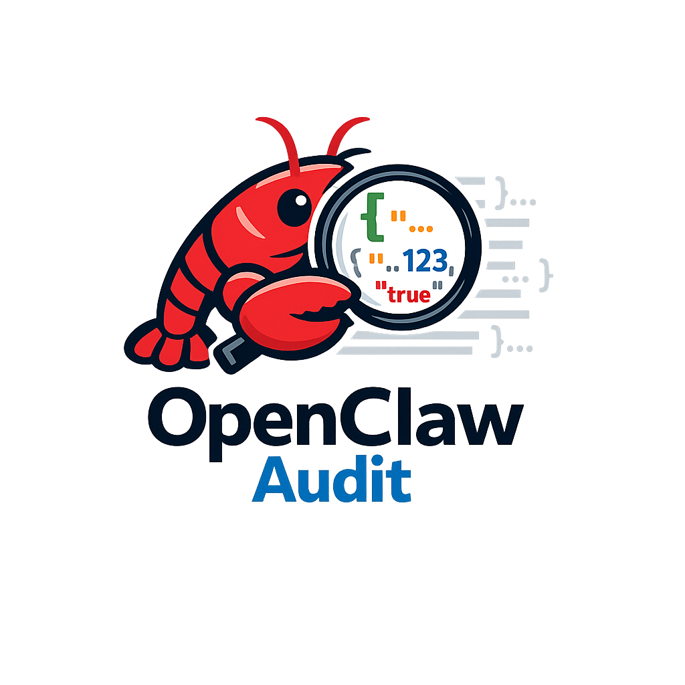

<div align="center">
  
  <h1 style="font-size: 28px; margin: 10px 0;">OpenClaw Session Audit</h1>
  <p>X-Ray Openclaw agents</p>
</div>

[](https://badge.fury.io/js/openclaw-session-audit)
[](https://opensource.org/licenses/MIT)
[](https://github.com/Sabrimjd/openclaw-session-audit/releases)

Monitor all OpenClaw session events and stream them to any channel (Discord, Telegram, Slack, etc.) in real-time.

```
🦞[clawd] (glm-5) 👥agent:main:discord:channel:123456789012345678 | 📁/home/user/clawd | 📊85k/200k (42%) | 🧠low | 🖥️discord | ⏰14:32 | 🔗session-abc123
14:32:15.214 💭 Thinking: "User wants to deploy the new feature. Let me check the current git status and run tests first."
14:32:15.214 ⚡ exec(1.2s): git status --short && npm test
14:32:18.447 💭 Thinking: "Tests passed. Now checking if there are any open PRs on this repo."
14:32:18.447 🔧 cron(89ms): list
14:32:20.123 📖 read(45ms): /home/user/clawd/AGENTS.md
14:32:22.891 ✏️ edit(112ms) (+8/-2 lines, +234/-89 chars): /home/user/clawd/MEMORY.md
14:32:25.556 🌐 web_search(1.1s): openai gpt-5 release date 2026
14:32:27.012 🌐 web_fetch(892ms): https://docs.openclaw.ai/channels/discord
14:32:30.334 🔎 memory_search(234ms): "docker compose" → 3 results from MEMORY.md#45-52
14:32:32.101 ⚙️ process(67ms): poll (background-task-xyz)
14:32:35.789 🚀 spawn(189ms): [zai/glm-4.7-flash]
🤖[workspace-subagent-test] (glm-4.7-flash)[subagent] [thread:1475062917547167754] agent:subagent-test:subagent:101d4e37-9b9b-4dc2-bb77-c7b85e8c7e6f | 📁/home/sab/.openclaw/workspace-subagent-test | 🧠low | 🖥️subagent | ⏰12:23 | 🔗101d4e37
14:32:40.222 🔊 tts(456ms): "Build completed successfully!"
14:32:42.015 📊 session_status(78ms)
14:32:45.890 📨 message(234ms): discord → channel:123456789012345678
14:32:48.123 ✅ Tool call succeeded: deploy.sh completed in 12.3s
14:32:50.456 ⏰ cron(156ms): run [daily-backup] → completed
14:32:52.789 🖼️ image(1.8s): analyze /tmp/screenshot.png
```

## Agent Skill

Share `skills/openclaw-session-audit/SKILL.md` with your AI agent for automated installation and configuration.

## Installation

```bash
openclaw plugins install openclaw-session-audit
```

## Updating

To update to the latest version:

```bash
# Remove old version and install latest
rm -rf ~/.openclaw/extensions/openclaw-session-audit
openclaw plugins install openclaw-session-audit

# Kill any orphaned daemon processes
pkill -f "session-audit"

# Restart the gateway
systemctl --user restart openclaw-gateway.service

# Verify only ONE daemon tree is running (5 processes)
ps aux | grep "session-audit" | grep -v grep | wc -l
```

To update to a specific version:

```bash
openclaw plugins install openclaw-session-audit@1.0.8
```

## Development

### Local Development Deployment

To test local changes without publishing:

```bash
# Copy entire plugin
rm -rf ~/.openclaw/extensions/openclaw-session-audit
cp -r /path/to/openclaw-session-audit ~/.openclaw/extensions/openclaw-session-audit

# Restart to apply changes
pkill -f "session-audit"
systemctl --user restart openclaw-gateway.service

# Verify daemon started
ps aux | grep "session-audit" | grep -v grep
```

### Manual Daemon Testing

Test the daemon directly without the gateway:

```bash
cd ~/.openclaw/extensions/openclaw-session-audit
SESSION_AUDIT_CHANNEL=discord \
SESSION_AUDIT_TARGET_ID=YOUR_CHANNEL_ID \
npx tsx src/index.ts
```

### Clear State (Debug)

To force reprocessing of all session files:

```bash
# Clear state file
rm -rf ~/.openclaw/extensions/openclaw-session-audit/state/state.json

# Restart daemon
pkill -f "session-audit"
systemctl --user restart openclaw-gateway.service
```

## Configuration

Configure in your OpenClaw config (`~/.openclaw/openclaw.json`):

```json
{
  "plugins": {
    "entries": {
      "openclaw-session-audit": {
        "enabled": true,
        "config": {
          "channel": "discord",
          "targetId": "YOUR_CHANNEL_ID"
        }
      }
    }
  }
}
```

### Configuration Options

| Option | Required | Description | Default |
|--------|----------|-------------|---------|
| `channel` | Yes | OpenClaw channel name (`discord`, `telegram`, `slack`, etc.) | - |
| `targetId` | Yes | Target ID (channel, group, or user ID) | - |
| `rateLimitMs` | No | Rate limit between messages (ms) | 2000 |
| `batchWindowMs` | No | Batch window for grouping events (ms) | 8000 |
| `maxBatchSize` | No | Max events per batch | 15 |
| `agentEmojis` | No | Emoji mappings for agents | `{ clawd: "🦞" }` |
| `headerIntervalMs` | No | How often to show session header (ms) | 60000 |

### Environment Variables

For advanced configuration, set these environment variables:

| Variable | Description |
|----------|-------------|
| `SESSION_AUDIT_DEBUG` | Enable verbose debug logging (`true`/`false`) |
| `SESSION_AUDIT_DEBUG_PROCESS_ALL` | Reprocess all history on startup (`true`/`false`) |

### Channel Examples

#### Discord

```json
{
  "channel": "discord",
  "targetId": "1474043146705830112"
}
```

#### Telegram

```json
{
  "channel": "telegram",
  "targetId": "-1001234567890"
}
```

#### Slack

```json
{
  "channel": "slack",
  "targetId": "C12345678"
}
```

## Logging

### Daemon Log File

The daemon writes logs to:
```
~/.openclaw/extensions/openclaw-session-audit/state/daemon.log
```

View live logs:
```bash
tail -f ~/.openclaw/extensions/openclaw-session-audit/state/daemon.log
```

### Enable Debug Logging

For troubleshooting, enable verbose debug logging:

**Method 1: Environment variable in index.ts** (temporary)
```typescript
// In index.ts, add before spawning daemon:
env.SESSION_AUDIT_DEBUG = "true";
```

**Method 2: Manual daemon with debug**
```bash
SESSION_AUDIT_DEBUG=true \
SESSION_AUDIT_CHANNEL=discord \
SESSION_AUDIT_TARGET_ID=YOUR_CHANNEL_ID \
npx tsx ~/.openclaw/extensions/openclaw-session-audit/src/index.ts
```

Debug output includes:
- Tool calls found and processed
- Events added to batches
- Batch flush details (event types, counts)
- Messages built and sent

### Gateway Logs

Check the OpenClaw gateway logs for plugin loading issues:
```bash
journalctl --user -u openclaw-gateway.service -f | grep -i session-audit
```

## Message Format

Each audit message contains a **header** with session metadata followed by **events**:

### Header Fields

| Field | Example | Description |
|-------|---------|-------------|
| `🤖[name]` | `🤖[sab]` | Agent/workspace name with emoji |
| `(model)` | `(qwen3-coder-plus)` | Current model in use |
| `👥/👤` | `👥agent:main:discord:...` | Chat type (group/direct) + session key |
| `[subagent]` | `[subagent]` | Tag if this is a subagent session |
| `[thread:N]` | `[thread:567]` | Thread number if in a thread |
| `📁` | `📁/home/sab` | Working directory |
| `📊` | `📊22k/262k (8%)` | Token usage (used/context window %) |
| `🧠` | `🧠off` | Thinking level (off/low/medium/high) |
| `🖥️` | `🖥️discord` | Surface (discord, telegram, cli, etc.) |
| `🔌` | `🔌discord` | Provider/channel type |
| `⏰` | `⏰13:22` | Session start time |
| `🔗` | `🔗14745425` | Group/channel ID (shortened) |

### Event Format

Each event is formatted as:
```
HH:mm:ss.ms ICON Event details
```

## Event Icons

| Icon | Event | Icon | Event |
|------|-------|------|-------|
| ⚡ | exec | ✏️ | edit |
| 📝 | write | 📖 | read |
| 🔍 | grep/glob | 🌐 | webfetch |
| 💬 | User message | ✅ | Response completed |
| 💭 | Thinking | ❌ | Error |
| 🔄 | Model change | 🗜️ | Context compaction |
| 🖼️ | Image | 🧠 | Thinking level |


## Features

### Event Tracking
- **Tool Calls** - exec, edit, write, read, etc. with durations
- **User Messages** - Sender name + preview
- **Response Completion** - Token counts
- **Thinking/Reasoning** - Agent thoughts
- **Errors** - Timeouts, API errors, aborts
- **Model Changes** - Mid-session switches
- **Context Compaction** - Token summaries

### Smart Formatting
- 40+ event-specific icons
- Millisecond timestamps
- Diff statistics (lines/chars added/removed)
- Session metadata (project, model, tokens)

### Performance
- Smart batching (groups events in time windows)
- Rate limiting (respects Discord limits)
- Handles large files (up to 10MB)
- State persistence across restarts
- **Skip history** - New sessions start at current position (no backfill)

## Troubleshooting

### No messages appearing
1. Verify config in `~/.openclaw/openclaw.json`
2. Check daemon is running: `ps aux | grep session-audit | grep -v grep`
3. Check daemon log: `tail -50 ~/.openclaw/extensions/openclaw-session-audit/state/daemon.log`
4. Check gateway logs: `journalctl --user -u openclaw-gateway.service -f | grep -i session-audit`
5. Restart gateway: `systemctl --user restart openclaw-gateway.service`

### Tool calls not being captured
This was a bug in versions < 1.0.11. Update to the latest version:
```bash
rm -rf ~/.openclaw/extensions/openclaw-session-audit
openclaw plugins install openclaw-session-audit
pkill -f "session-audit"
systemctl --user restart openclaw-gateway.service
```

### Multiple daemon instances
If you see duplicate messages, there may be multiple daemon processes:
```bash
# Check process count (should be 5 = 1 daemon tree)
ps aux | grep "session-audit" | grep -v grep | wc -l

# Kill all and restart
pkill -f "session-audit"
systemctl --user restart openclaw-gateway.service
```

### State file issues
If events are being skipped or duplicated, try clearing the state:
```bash
rm ~/.openclaw/extensions/openclaw-session-audit/state/state.json
systemctl --user restart openclaw-gateway.service
```

### Uninstall
```bash
openclaw plugins uninstall openclaw-session-audit
```

## How It Works

1. **Watch** - Monitors OpenClaw session files via `fs.watch`
2. **Parse** - Reads new JSON lines from current position
3. **Track** - Records events with timestamps
4. **Batch** - Groups events within time window
5. **Send** - Uses `openclaw message send` to deliver to configured channel

## Migration from discord-audit-stream

If you were using `openclaw-discord-audit-stream`:

1. Uninstall old plugin:
   ```bash
   openclaw plugins uninstall openclaw-discord-audit-stream
   ```

2. Install new plugin:
   ```bash
   openclaw plugins install openclaw-session-audit
   ```

3. Update config (change `webhookUrl`/`fallbackChannelId` to `channel`/`targetId`):
   ```json
   {
     "plugins": {
       "entries": {
         "openclaw-session-audit": {
           "enabled": true,
           "config": {
             "channel": "discord",
             "targetId": "YOUR_CHANNEL_ID"
           }
         }
       }
     }
   }
   ```

## License

MIT License - See [LICENSE](LICENSE)

## Support

- **GitHub**: https://github.com/Sabrimjd/openclaw-session-audit
- **npm**: https://www.npmjs.com/package/openclaw-session-audit
- **Issues**: https://github.com/Sabrimjd/openclaw-session-audit/issues
