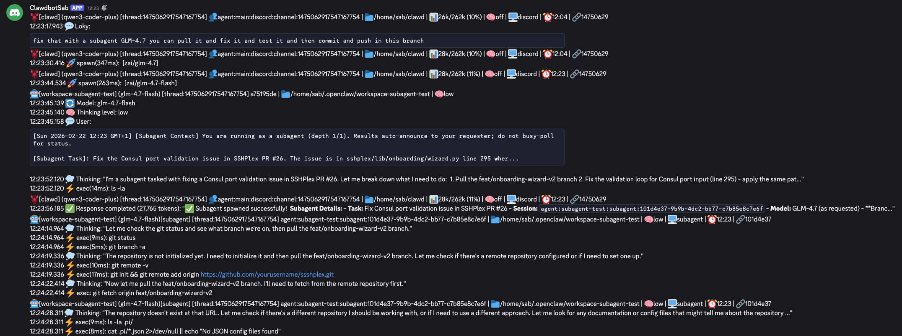

# OpenClaw Session Audit


[](https://badge.fury.io/js/openclaw-session-audit)
[](https://opensource.org/licenses/MIT)
[](https://github.com/Sabrimjd/openclaw-session-audit/releases)

Monitor all OpenClaw session events and stream them to any channel (Discord, Telegram, Slack, etc.) in real-time.




## Installation

```bash
openclaw plugins install openclaw-session-audit
```

## Updating

To update to the latest version:

```bash
# Remove old version and install latest
rm -rf ~/.openclaw/extensions/openclaw-session-audit
openclaw plugins install openclaw-session-audit

# Kill any orphaned daemon processes
pkill -f "session-audit"

# Restart the gateway
systemctl --user restart openclaw-gateway.service

# Verify only ONE daemon tree is running (5 processes)
ps aux | grep "session-audit" | grep -v grep | wc -l
```

To update to a specific version:

```bash
openclaw plugins install openclaw-session-audit@1.0.8
```

## Configuration

Configure in your OpenClaw config (`~/.openclaw/openclaw.json`):

```json
{
  "plugins": {
    "entries": {
      "openclaw-session-audit": {
        "enabled": true,
        "config": {
          "channel": "discord",
          "targetId": "YOUR_CHANNEL_ID"
        }
      }
    }
  }
}
```

### Configuration Options

| Option | Required | Description | Default |
|--------|----------|-------------|---------|
| `channel` | Yes | OpenClaw channel name (`discord`, `telegram`, `slack`, etc.) | - |
| `targetId` | Yes | Target ID (channel, group, or user ID) | - |
| `rateLimitMs` | No | Rate limit between messages (ms) | 2000 |
| `batchWindowMs` | No | Batch window for grouping events (ms) | 8000 |
| `maxBatchSize` | No | Max events per batch | 15 |
| `agentEmojis` | No | Emoji mappings for agents | `{ clawd: "🦞" }` |

### Channel Examples

#### Discord

```json
{
  "channel": "discord",
  "targetId": "1474043146705830112"
}
```

#### Telegram

```json
{
  "channel": "telegram",
  "targetId": "-1001234567890"
}
```

#### Slack

```json
{
  "channel": "slack",
  "targetId": "C12345678"
}
```

## Message Format

Each audit message contains a **header** with session metadata followed by **events**:

```
🤖[sab] (qwen3-coder-plus) 👥agent:main:discord:channel:1474542... | 📁/home/sab | 📊22k/262k (8%) | 🧠off | 🖥️discord | 🔌discord | ⏰13:22 | 🔗14745425
13:49:41.24 💬 Loky:
I created this how can i advertise it to share it to the open source community ?
13:49:51.37 ✅ Response completed (22,365 tokens): " To advertise your OpenClaw project..."
```

### Header Fields

| Field | Example | Description |
|-------|---------|-------------|
| `🤖[name]` | `🤖[sab]` | Agent/workspace name with emoji |
| `(model)` | `(qwen3-coder-plus)` | Current model in use |
| `👥/👤` | `👥agent:main:discord:...` | Chat type (group/direct) + session key |
| `[subagent]` | `[subagent]` | Tag if this is a subagent session |
| `[thread:N]` | `[thread:567]` | Thread number if in a thread |
| `📁` | `📁/home/sab` | Working directory |
| `📊` | `📊22k/262k (8%)` | Token usage (used/context window %) |
| `🧠` | `🧠off` | Thinking level (off/low/medium/high) |
| `🖥️` | `🖥️discord` | Surface (discord, telegram, cli, etc.) |
| `🔌` | `🔌discord` | Provider/channel type |
| `⏰` | `⏰13:22` | Session start time |
| `🔗` | `🔗14745425` | Group/channel ID (shortened) |

### Event Format

Each event is formatted as:
```
HH:mm:ss.ms ICON Event details
```

## Event Icons

| Icon | Event | Icon | Event |
|------|-------|------|-------|
| ⚡ | exec | ✏️ | edit |
| 📝 | write | 📖 | read |
| 🔍 | grep/glob | 🌐 | webfetch |
| 💬 | User message | ✅ | Response completed |
| 💭 | Thinking | ❌ | Error |
| 🔄 | Model change | 🗜️ | Context compaction |
| 🖼️ | Image | 🧠 | Thinking level |

## Agent Skill

Share `skills/openclaw-session-audit/SKILL.md` with your AI agent for automated installation and configuration.

## Features

### Event Tracking
- **Tool Calls** - exec, edit, write, read, etc. with durations
- **User Messages** - Sender name + preview
- **Response Completion** - Token counts
- **Thinking/Reasoning** - Agent thoughts
- **Errors** - Timeouts, API errors, aborts
- **Model Changes** - Mid-session switches
- **Context Compaction** - Token summaries

### Smart Formatting
- 40+ event-specific icons
- Millisecond timestamps
- Diff statistics (lines/chars added/removed)
- Session metadata (project, model, tokens)

### Performance
- Smart batching (groups events in time windows)
- Rate limiting (respects Discord limits)
- Handles large files (up to 10MB)
- State persistence across restarts
- **Skip history** - New sessions start at current position (no backfill)

## Troubleshooting

### No messages appearing
1. Verify config in `~/.openclaw/openclaw.json`
2. Restart gateway: `openclaw gateway restart`
3. Check daemon: `ps aux | grep daemon.ts`
4. Check logs: `journalctl --user -u openclaw-gateway.service -f`

### Uninstall
```bash
openclaw plugins uninstall openclaw-session-audit
```

## How It Works

1. **Watch** - Monitors OpenClaw session files via `fs.watch`
2. **Parse** - Reads new JSON lines from current position
3. **Track** - Records events with timestamps
4. **Batch** - Groups events within time window
5. **Send** - Uses `openclaw message send` to deliver to configured channel

## Migration from discord-audit-stream

If you were using `openclaw-discord-audit-stream`:

1. Uninstall old plugin:
   ```bash
   openclaw plugins uninstall openclaw-discord-audit-stream
   ```

2. Install new plugin:
   ```bash
   openclaw plugins install openclaw-session-audit
   ```

3. Update config (change `webhookUrl`/`fallbackChannelId` to `channel`/`targetId`):
   ```json
   {
     "plugins": {
       "entries": {
         "openclaw-session-audit": {
           "enabled": true,
           "config": {
             "channel": "discord",
             "targetId": "YOUR_CHANNEL_ID"
           }
         }
       }
     }
   }
   ```

## License

MIT License - See [LICENSE](LICENSE)

## Support

- **GitHub**: https://github.com/Sabrimjd/openclaw-session-audit
- **npm**: https://www.npmjs.com/package/openclaw-session-audit
- **Issues**: https://github.com/Sabrimjd/openclaw-session-audit/issues
